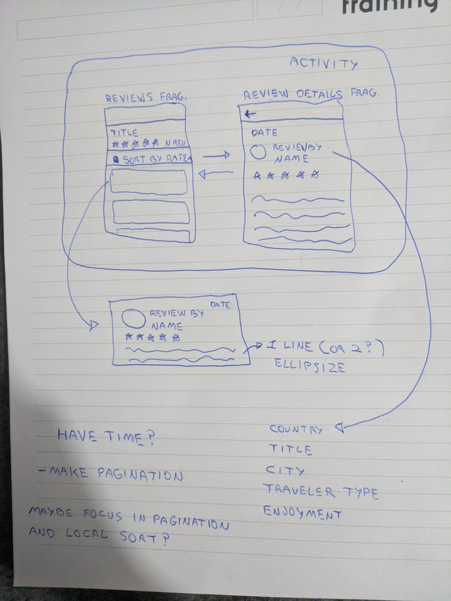

# About
The application use travelers-api to load reviews from remote server and
present them using pagination

# Project structure
Explore the project master branch and packages to see how it works. The project architecture is MVVM with Clean Architecture using SOLID concepts.

### Overview
The `app` module is the main entry.

### Tests
Unit and Automated tests are implemented.

# Planning

### Features organization

I have organized my code by feature. This avoid to share knowledge between feature without is required.

- **Reviews Screen**
  * Show reviews 
  * Use pagination
  * Sort by rating
  * Show activity informations
  * Show activity average rate 
  * Refresh page for clear cache
- **Review Details Screen**
  * Show review details

# WARNING

- Automated tests works only API 26 or greater.
- Automated tests works only with animation disabled.